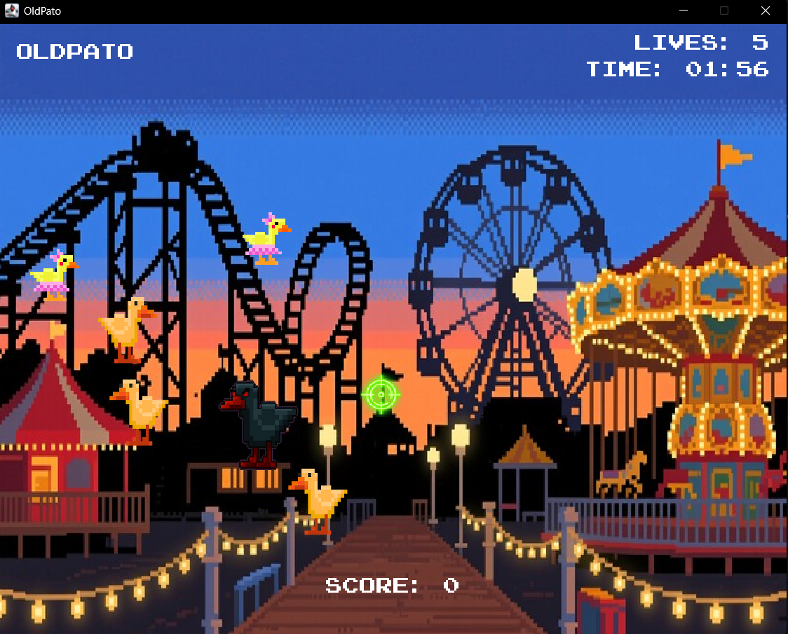
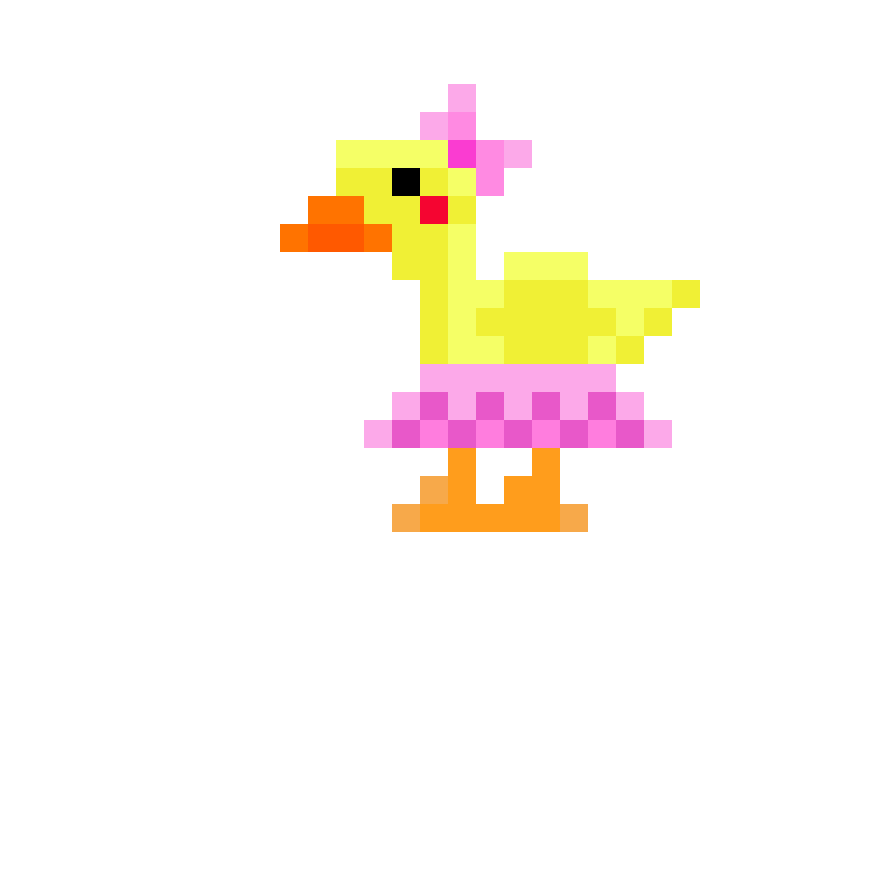
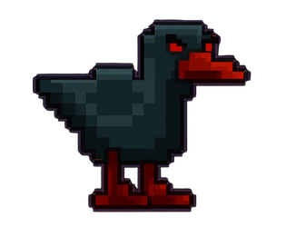
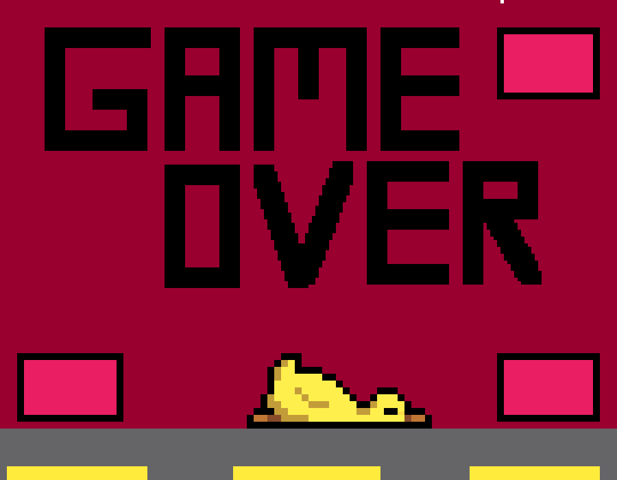

# OldPato


OldPato es un juego de disparos estilo feria desarrollado en Java con Swing, inspirado en el clásico juego de matar patos. El jugador controla una mira, dispara a distintos tipos de patos y trata de conseguir el mayor puntaje antes de quedarse sin tiempo o sin vidas.

## Estado del Proyecto

Proyecto terminado.

## Descripción

La partida inicia en una pantalla de bienvenida donde el jugador ingresa su nombre. Durante el juego, los patos se mueven por la pantalla y cada tipo de pato tiene un efecto diferente al recibir un disparo. Al terminar, se muestra una pantalla de game over con el nombre del jugador, puntaje, tiempo jugado y el top 3 histórico.

Los puntajes se guardan en `OldPato/scores.txt`, por lo que no se pierden al cerrar la aplicación.

## Screenshots

### Gameplay


### Mira


### Desarrollo



### Patos





### Game Over



### Logo UAM


## Tipos de Patos

| Pato | Efecto al disparar |
|---|---|
| Duck | +10 puntos y +1 segundo. |
| Duckencia | -1 vida. |
| EvilDuck | +20 segundos. Cada 3 disparos a EvilDuck se recupera 1 vida, sin superar las 5 vidas iniciales. |

## Mecánicas de Juego

- **Vidas:** 5 vidas iniciales.
- **Puntuación:** +10 puntos por cada Duck eliminado.
- **Tiempo:** 2 minutos base.
- **Duck normal:** añade 1 segundo.
- **EvilDuck:** aparece temporalmente durante 2 segundos y añade 20 segundos al recibir un disparo.
- **Recuperación de vida:** cada 3 disparos acertados a EvilDuck se recupera 1 vida.
- **Duckencia:** resta 1 vida.
- **Game Over:** ocurre cuando el tiempo llega a 0 o las vidas se agotan.
- **Historial:** cada partida guarda el jugador y puntaje en `OldPato/scores.txt`.
- **Top 3:** la pantalla de game over muestra los mejores 3 puntajes guardados.
- **Feedback visual:** cada disparo muestra una explosión breve en el centro de la mira.

## Controles

| Acción | Control |
|---|---|
| Mover la mira | Mouse |
| Disparar | Clic izquierdo |
| Mover la mira con mando | Stick izquierdo |
| Disparar con mando | Gatillo derecho / R2 |
| Iniciar juego | Enter o botón Iniciar |
| Volver al menú desde Game Over | Enter o botón Volver al menu |

## Instalación y Ejecución

### Opción recomendada: IntelliJ IDEA

1. Abre el proyecto desde la carpeta raíz `pato`.
2. Importa el `pom.xml` como proyecto Maven.
3. Verifica que el JDK esté configurado.
4. Ejecuta la clase `view.MainFrame`.

### Maven

El proyecto incluye `pom.xml` con las dependencias de JInput:

```bash
mvn compile
```

## Compatibilidad con Mando

El soporte para mando usa JInput:

- `jinput-2.0.10`
- `windows-plugin-2.0.10`

El juego intenta detectar mandos tipo gamepad, joystick o Xbox. El disparo con mando está configurado para usar el gatillo derecho/R2. Si el mando no responde, revisa que el sistema operativo lo esté detectando y que las librerías nativas de JInput estén disponibles.

## Recursos

El juego carga imágenes, fuentes y sonidos desde `OldPato/src/main/resources`:

- `images`
- `fonts`
- `sounds`

## Tecnologías

- Java
- Java Swing
- Maven
- JInput para soporte de mando
- `javax.sound.sampled` para música y efectos de sonido
- `Thread` para el movimiento independiente de los patos
- `javax.swing.Timer` para temporizadores de juego y efectos visuales

## Arquitectura

El proyecto sigue una organización tipo MVC:

- `model`: entidades y estado del juego.
- `view`: paneles, HUD y ventana principal.
- `controller`: entrada de mouse, teclado, mando y flujo de partida.
- `util`: sonido y persistencia de puntajes.

## Autores

- Sergio Arango — [@sergioaarangoh-cpu](https://github.com/sergioaarangoh-cpu)
- Juan Sebastián Echeverri — [@juancho-2006](https://github.com/juancho-2006)
- Victor Manuel Reyes — [@Victor13578](https://github.com/Victor13578)
