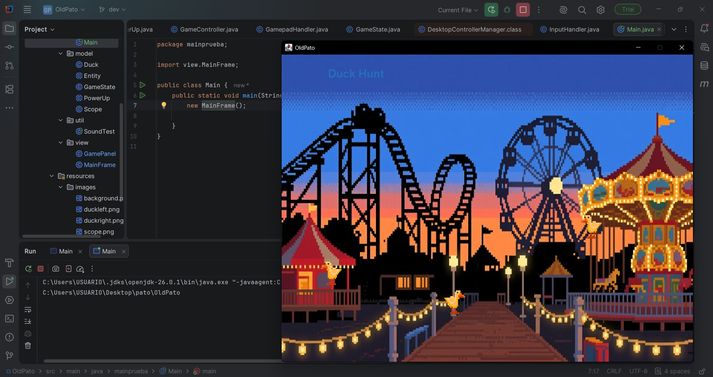
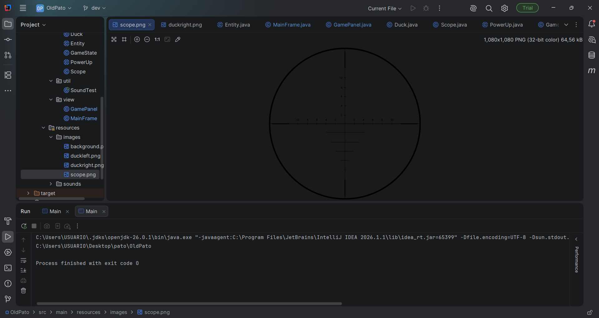

# OldPato 

Un juego de disparos estilo feria desarrollado en Java con Swing, inspirado en el clásico juego de matar patos.
El pato más old de todos los patos llega a tu portátil éste 2026!

## Descripción
El jugador controla una mira en la pantalla y debe disparar a los patos que vuelan antes de que se acabe el tiempo o las vidas. Cada pato eliminado suma puntos y extiende el tiempo de juego. Cuidado con los patos amigos y los patos malvados, cada uno tiene sus propias consecuencias.

## Screenshots

## Tipos de patos
| Pato | Efecto al disparar |
|---|---|
|  Duck | +10 puntos y +5 segundos, molestos patos que hacen cuac en el parque |
|  Duckencia | -1 vida, por qué le dispararías a esta bella patica? |
|  EvilDuck | +20 segundos, muere patito feo |

## Mecánicas de juego
- **Vidas:** 5 vidas iniciales. Se pierde una vida cada vez que se le dispara a una Duckencia.
- **Puntuación:** +10 puntos por cada Duck eliminado.
- **Tiempo:** 2 minutos base. Eliminar un Duck añade 5 segundos, eliminar un EvilDuck añade 20 segundos.
- **Game Over:** cuando el tiempo llega a 0 o las vidas se agotan.

## Controles
| Acción | Control |
|---|---|
| Mover la mira | Mouse |
| Disparar | Clic izquierdo |
| Mover la mira con mando | Stick izquierdo |
| Disparar con mando | Botón A o gatillo derecho |
| Iniciar juego | Enter o clic |
| Volver al menú | Escape |

>  El soporte para mando usa JInput. Agrega manualmente los jars en IntelliJ (`Project Structure > Modules > Dependencies`):
> - `jinput-2.0.10.jar`
> - `jinput-2.0.10-natives-all.jar` (o el nativo de tu sistema operativo)

## Compatibilidad Linux/Windows
- El juego carga imágenes, fuentes y sonidos por **classpath** (`/images`, `/fonts`, `/sounds`), por lo que funciona con rutas portables en Linux y Windows.
- Si aparece `JInput no reportó controladores`, el sistema operativo no está exponiendo el mando a JInput en ese momento.
- En Linux valida primero a nivel SO con `ls /dev/input/js*`, `ls /dev/input/event*` y `jstest /dev/input/js0`.

## Tecnologías
- Java (OpenJDK 26)
- Java Swing
- `javax.sound.sampled` para efectos de sonido y música
- `Thread` para movimiento independiente de cada pato
- `javax.swing.Timer` para el contador de tiempo

## Arquitectura
MVC + principios SOLID, en particular:
- **SRP** (Single Responsibility Principle): cada clase tiene una única responsabilidad.
- **DIP** (Dependency Inversion Principle): las clases de alto nivel dependen de abstracciones.

## Estado del proyecto
 En desarrollo.

## Autores
Sergio Arango — [@sergioaarangoh-cpu](https://github.com/sergioaarangoh-cpu)
Juan Sebastián Echeverri — [@juancho-2006](https://github.com/juancho-2006)
Victor Manuel Reyes — [@Victor13578](https://github.com/Victor13578)
